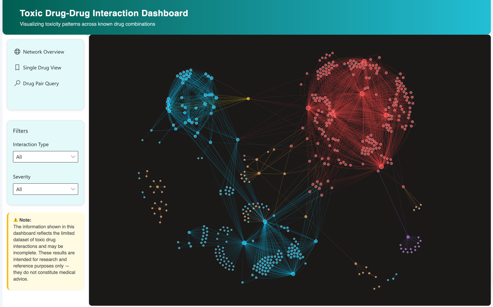
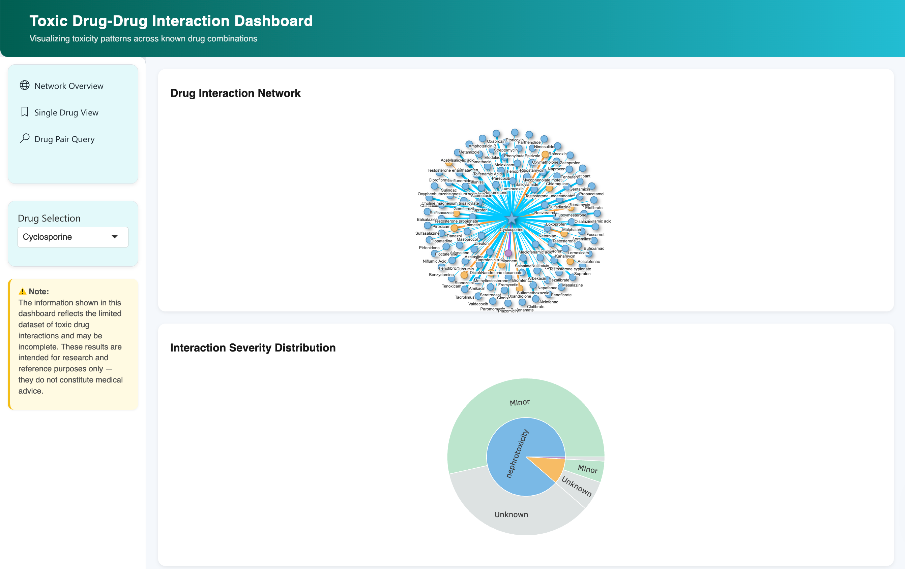
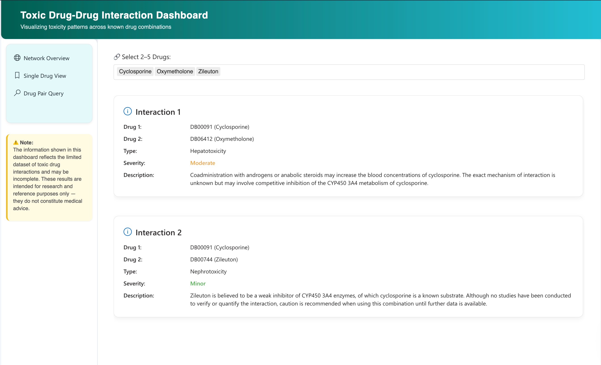

# 💊 ToxicDDI Explorer: Visualizing Toxic Drug-Drug Interactions
An interactive Shiny dashboard for exploring **toxic drug-drug interactions (DDIs)** by toxicity type and severity, enriched with clinical context from DrugBank and DDInter. This visualization tool supports healthcare professionals, researchers, and students in understanding the risks and relationships of harmful drug combinations.

---

## 🧭 Project Overview

Drug-drug interactions are a major cause of adverse drug reactions (ADRs), yet most tools offer static, non-exploratory data views. **ToxicDDI Explorer** bridges this gap through a dynamic, modular dashboard offering:
- Visual exploration of global DDI networks
- Drug-centric interaction profiles
- Targeted drug pair queries with severity and clinical descriptions
---

## 🧩 Core Functionalities

The dashboard includes **three main interactive tabs**, each tailored to different analytical needs:

### Network Overview
- Explore the global DDI structure via force-directed network graphs.
- Visual encodings:
  - **Edge color** = Toxicity type (10 categories)
  - **Edge thickness** = Severity level (Major, Moderate, Minor, Unknown)
  - **Node size** = Degree centrality
  - **Node color** = Dominant toxicity type

### Single Drug View
- Focused interaction network around a selected drug.
- Sunburst chart summarizing the drug’s toxicity types and severities.

### Drug Pair Query
- Select 2–5 drugs and retrieve all toxic interactions between them.
- View interaction type, severity, description, and management notes in a clean, card-based layout.

---

## ⚙️ Technical Stack

| Component         | Role                                                  |
|------------------|-------------------------------------------------------|
| **R & Shiny**     | Core framework for dashboard logic and interactivity |
| `visNetwork`      | Network graphs with node/edge styling and filtering  |
| `plotly`          | Sunburst chart for severity breakdown visualization  |
| `dplyr`, `tidyr`  | Tidyverse tools for data wrangling                   |
| `scales`          | Rescaling visual encodings (e.g., node size, opacity)|
| `shiny.fluent`    | Fluent Design-based modern UI components             |
| `shiny.react`     | React-based UI enhancements                          |
| `Selenium (Python)` | Data crawling from DDInter                          |

---

## 🚀 Installation Guide

### System Requirements
- R version ≥ 4.0.0
- Recommended: RStudio or VSCode with R extension

### Install Required R Packages

```r
install.packages(c("shiny", "shiny.fluent", "shinycssloaders", "visNetwork", "shinyjs", "plotly", "dplyr", "tidyr", "scales"))
```

### Launch the Application

```r
# In R or RStudio:
shiny::runApp("app.R")
```
> 📍 Make sure `data/network_data.rds` and `data/ddi_with_ddinter_info.csv` are present in the `data/` folder.

---

## 🖼️  Dashboard Screenshots

 



 

---

## 📂 Data Sources

* **DrugBank / Mendeley Data**: Raw DDI records and toxicity categories
* **DDInter v2.0**: Clinical severity levels, interaction descriptions, and management guidance
* **Custom Crawling**: Automated with Selenium to enrich data with DDInter fields
---

## 👨‍💻 Team Members 
* Phan Thi Hien Chi
* Nguyen Mau Hoang Hiep
* Thai Ba Hung

This project was developed as part of **COMP4010: Data Visualization (Spring 2025)**. We would like to thank the instruction team for their guidance throughout this project!
---

## ⚠️ Disclaimer

> This dashboard is for **educational and research purposes only**. It is **not** a clinical decision support tool.
> The data presented is based on curated sources but may be incomplete or subject to reporting bias.
> Always consult professional medical advice before making any healthcare decisions.

---

## 📚 References

1. Yu, H. (2020). *Data of multiple-type drug-drug interactions*. Mendeley Data.
2. Knox, C., et al. (2024). *DrugBank 6.0: The DrugBank Knowledgebase*. Nucleic Acids Res.
3. Tian, Y., et al. (2025). *DDInter 2.0: An Enhanced Drug Interaction Resource*. Nucleic Acids Res.
4. Khatkhatay, M. A., & Gokhale, S. (2021). *EDAV Community Contributions*.
5. Jiang, H., et al. (2022). *Adverse Drug Reactions and Correlations with DDIs*. Front. Pharmacol.
---

